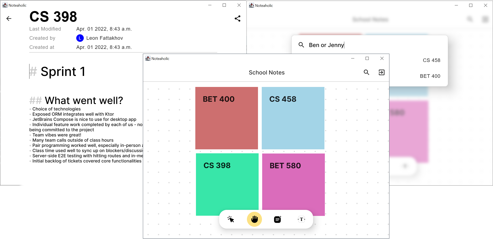

 

  

  <h3 align="center">A Canvas Based Note Taking Application</h3>
  <h4 align="center">Leon Fattakhov, Advait Maybhate, Steven Xu, Kelvin Zhang</h3>

## Table of Contents
[[_TOC_]]

## Quick Start Guide

 
 

Additional information is included in our [wiki](https://git.uwaterloo.ca/lfattakh/cs398project/-/wikis/home)

## Contributing

This project requires the following tools to be installed to compile and run the code.
* Docker
* Docker Compose
* Kotlin

This project is broken into two separate portions:
* [The Server](https://git.uwaterloo.ca/lfattakh/cs398project/-/tree/master/server)
* [The Client](https://git.uwaterloo.ca/lfattakh/cs398project/-/tree/master/client)

Each of these have their own `README.md` files to help setup the development environment.
However the server should be launched before the client in order to speed up development. As the client will switch empty waiting for server state until it detects that the server is running.

## The Team

<table align="center">
<tr>
  <td align="center">
     
    <h4>Leon Fattakhov</h4>
  </td>
  <td align="center">
     
    <h4>Advait Maybhate</h4>
  </td>
  <td align="center">
     
    <h4>Steven Xu</h4>
  </td>
  <td align="center">
     
    <h4>Kelvin Zhang</h4>
  </td>
</tr>
</table>

## License

## Third Party Libraries & Code

### Citations
- Borders.kt - https://gist.github.com/gildor/ff7f56da7216ae9e4da77368a4beb87a
- K9 Email Validation Regex - https://github.com/k9mail/k-9
- Kotlin resources retrieval - https://stackoverflow.com/questions/42739807/how-to-read-a-text-file-from-resources-in-kotlin
- Canvas focusing in Jetpack Compose - https://medium.com/google-developer-experts/focus-in-jetpack-compose-6584252257fe
- Order of focus modifiers - https://stackoverflow.com/questions/70015530/unable-to-focus-anything-other-than-textfield
- How to create a fat JAR with dependencies - https://stackoverflow.com/questions/41794914/how-to-create-a-fat-jar-with-gradle-kotlin-script
- Improving performance with keys - https://pankaj-rai.medium.com/jetpack-compose-optimize-list-performance-with-key-1066567339f9
- Parsing Bold HTML Tags in a clean way - https://stackoverflow.com/questions/66494838/android-compose-how-to-use-html-tags-in-a-text-view

### Libraries:
  - JetBrains Exposed SQL Framework - https://github.com/JetBrains/Exposed
  - Ktor Server and Client - https://github.com/ktorio/ktor
  - Xerial SQLite - https://github.com/xerial/sqlite-jdbc
  - Postgres PGJDBC-NG - https://github.com/impossibl/pgjdbc-ng
  - Mindrot JBCrypt - https://www.mindrot.org/projects/jBCrypt/
  - JetBrains Compose Desktop - https://github.com/JetBrains/compose-jb
  - Androidx Jetpack Compose - https://github.com/androidx/androidx
  - SendGrid (for sending emails) - https://docs.sendgrid.com/for-developers/sending-email/v3-java-code-example
  - Compose Color Picker - https://github.com/godaddy/compose-color-picker
  - JetBrains Markdown Parser - https://github.com/JetBrains/markdown
  - Kotlinx Datetime - https://github.com/Kotlin/kotlinx-datetime/

